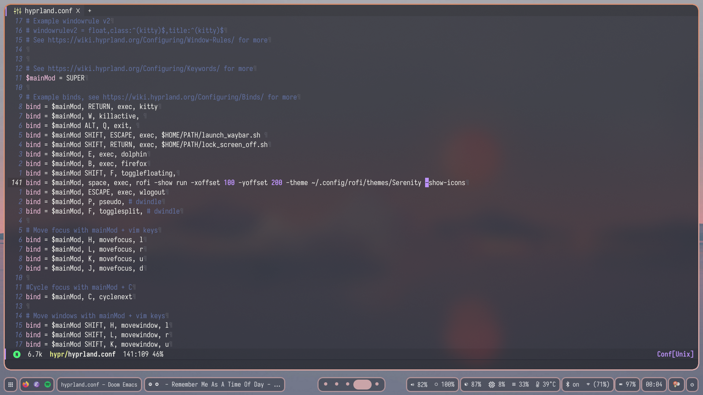

<!-- markdown-toc start - Don't edit this section. Run M-x markdown-toc-refresh-toc -->
**Table of Contents**

- [Hyprland configs: Serenity](#hyprland-configs-serenity)
    - [Images](#images)
        - [Rofi](#rofi)
        - [Dolphin](#Dolphin)
        - [Wlogout](#wlogout)
        - [emacs](#emacs)
        - [Neovim](#neovim)
        - [Kitty with Powerlevel10k for zsh](#kitty-with-powerlevel10k-for-zsh)
        - [Swaylock-effects](#swaylock-effects)
    - [Dependencies](#dependencies)
    - [Optional Dependencies](#optional-dependencies)

<!-- markdown-toc end -->
#  Hyprland configs: Serenity
## Images
### Rofi

### Dolphin

### Wlogout

### emacs

### Neovim

### Kitty with Powerlevel10k for zsh

### Swaylock-effects

## Dependencies
+ Hyprland
+ Hyprpaper
+ Waybar
+ kitty
+ Rofi
+ [rofi-emoji](https://github.com/Mange/rofi-emoji) 
+ Cliphist
+ Wlogout
+ Swaylock-effects
+ [Moe Dark Kvantum Theme](https://store.kde.org/p/1378414) 
+ swayidle
+ dunst
+ pamixer
+ brightnessctl

## Optional Dependencies
+ Dolphin
+ doom emacs with dracula theme(or any emacs compiled with GTK for tranparency to work on wayland)
+ neovim
+ [Powerlevel10k for zsh](https://github.com/romkatv/powerlevel10k) 

